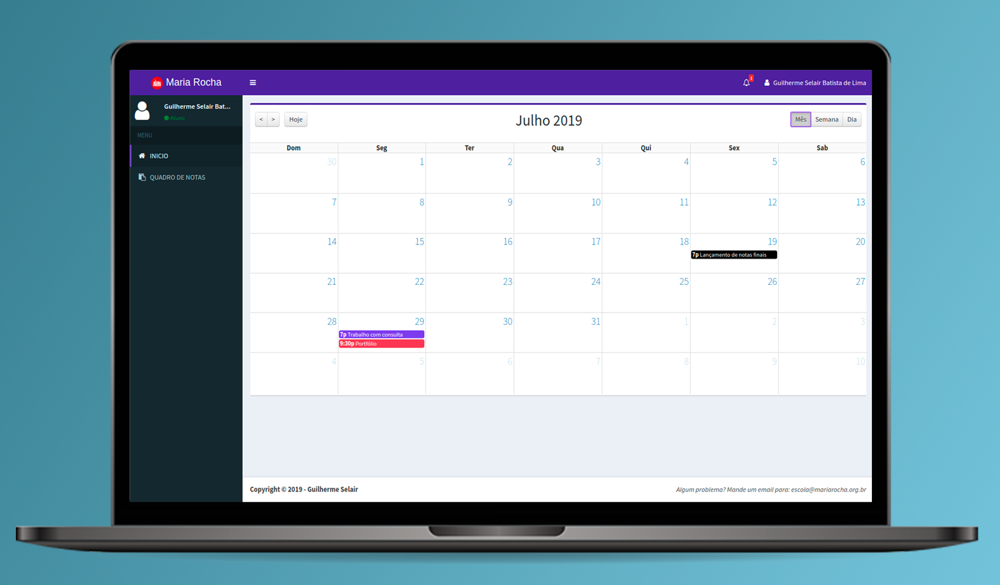

<h1 align="center">
    Portal Acadêmico da Escola Estadual de Ensino Médio Professora Maria Rocha
</h1>

> Portal acadêmico com funcionalidades de lançamentos de notas e calendário, desenvolvido em 2019.

## Introdução

A Escola Maria Rocha é uma escola estadual que além de possuir o ensino médio, possui também cursos técnicos de Informática, Secretariado e Contabilidade. Desenvolvido a fim de atualizar e renovar o antigo website da escola este foi meu TCC de conclusão do curso Técnico em Informática.

## Portal Acadêmico

Foi solicitado o desenvolvimento de um portal acadêmico para facilitar o acesso dos alunos e professores no controle de notas como também facilitar a marcação de reuniões e atividades para alunos e professores.

Além disso, junto com o Portal foi solicitado também a renovação do WebSite da site. O repositorio do site pode ser acessado [AQUI](https://github.com/GuiSelair/Site-Escola-Maria-Rocha).

Durante a execução deste projeto vale destacar a manipulação das seguintes tecnologias:
 - Bootstrap
 - PHPMailer
 - Segurança de dados
 - PHP
 - MYSQL
 - AJAX
 - JQUERY

## Status do projeto

 - **FINALIZADO**

## Autor

Guilherme Selair – [@GuiSelair](https://github.com/GuiSelair)

